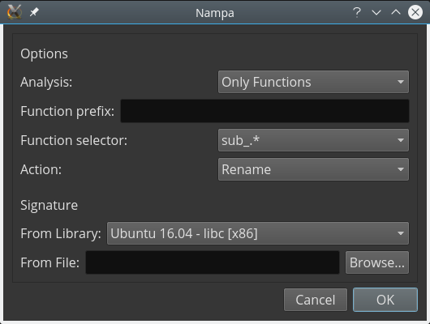

# Nampa - FLIRT for (binary) ninjas

Author: **github.com/kenoph**

*Pure-python implementation of IDA Pro's FLIRT technology, and Binary Ninja plugin.*

**Note:** This project is still in an experimental phase and may fail to work or to recognize some functions.

## Description

Nampa is a package for reading IDA Pro's `.sig` files.
It comes with its own command-line tool for analyzing such files: `dumpsig.py`.

This repository will likely be split into a python-only package and a Binary Ninja plugin in the future,
as the former is completely decoupled from the latter.

Nampa comes with a small library of `.sig` files, automatically downloaded
from 3rd-party GitHub repositories when needed.

## Screenshot



## Installation

For use as a python library:

```bash
pip install nampa
```

For use as a Binary Ninja plugin:

```bash
cd ~/.binaryninja/plugins/
git clone git@github.com:kenoph/nampa.git
cd nampa
pip install -r requirements.txt # or sudo apt-get install python-future
```

**NOTE:** apparently, Binary Ninja for Windows ships with its own python distribution so `pip install` accordingly.

## About

Nampa ([なんぱ](http://jisho.org/search/%E8%BB%9F%E6%B4%BE)) is the Japanese art of picking up women on the street.

### Limitations

The code needs some real-world testing to rule out bugs introduced during the porting of flirt.c to python.

### Credits

A big part of this project is basically a python port of
[radare's FLIRT implementation](https://raw.githubusercontent.com/radare/radare2/e8f80a165c7dd89d955a1ee7f432bd9a1ba88976/libr/anal/flirt.c).

### License

The original radare's flirt.c is under LGPL, so my deep knowledge of software licenses tells me that I must keep it
that way.
